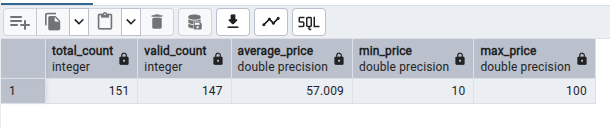

# Pipeline micro batches

## Archivos para revisión

Los archivos principales se encuentran en la carpeta pipeline, los cuales son [main.py](./pipeline/main.py) y [functions.py](./pipeline/functions.py).

## Resultados

Estadísticas de la tabla luego de ejecutar la población de datos:

| Cantidad de filas | Precio promedio | Precio mínimo | Precio máximo |
| ----------------- | --------------- | ------------- | ------------- |
| 143               | 57.886          | 10            | 100           |

Estadísticas de la tabla luego de ejecutar la etapa de validación:

| Cantidad de filas | Precio promedio | Precio mínimo | Precio máximo |
| ----------------- | --------------- | ------------- | ------------- |
| 151               | 57.009          | 10            | 100           |



## Replicación del entorno

Requerimientos: Docker y docker compose

### Inicialización de base de datos

Para replicar el entorno usando docker, primero ejecutamos el archivo `setup.sh`, el cual creará un docker network específico para este proyecto.

Luego, para levantar la base de datos en postgres, y el visualizador pgAdmin entramos a la carpeta `database` y ejecutamos

```
docker compose up -d
```

Una vez los servicios son levantados, podemos utilizar el navegador para ingresar a pgAdmin con el link: [http://localhost:5050](http://localhost:5050)

Las credenciales son `postgres@postgres.com` como usuario y `postgres` como password.

Configuramos nuestro servidor de postgres y en la base de datos ejecutamos los queries presentes en [init.sql](./database/init.sql) para inicializar las tablas dos `transactions` y `transactions_stats`, este último hará el tracking de la cuenta de filas, average, min y max de los precios que se suban a la primera tabla, y se actualizará cada que se inserta una fila.

### Ejecución del pipeline

Luego de tener la base de datos y las tablas inicializadas, ejecutaremos el pipeline de datos, considerando una etapa de población de datos y otra etapa de validación. La etapa de población se encarga de cargar todos los archivos .csv, a excepción del validation.csv, el cual pertenece a la etapa de validación. El código mostrará las métricas cada que se sube un nuevo archivo, sin embargo se recalca que las métricas se actualizan por cada fila, y que se muestra solo después de cada archivo por practicidad.

Para ejecutar el pipeline, ingrsar a la carpeta `pipeline` y ejecutar:

```
doocker compose up --build
```

Se podrá visualizar los datos en los logs de docker pues estos se obtienen de la tabla `transactions_stats`

## Consideraciones importantes

- Para esta prueba en específico, el pipeline solo es necesario ejecutarse una sola vez, si se vuelve a ejecutar, los datos serán duplicados
- La columna `total_count` de nuestra tabla `transaction_stats` considera todas las filas, pero se ha agregado una columna `valid_count` que considera solo los valores no nulos de los precios que ingresan a la tabla `transactions` de forma que las estadísticas `average_price`, `min_price` y `max_price` solo se ven afectados por valores no nulos.
- Para obtener las estadísticas siempre se usa el último valor de la misma tabla para actualizarlo, de forma que se usa el método recursivo para el cálulo del promedio.

## Recomendaciones

- Conforme este proyecto crece, se recomienda unificar los compose que actualmente se ejecutan de forma individual. Actualmente el setup permite la modularidad de los servicio, de tal forma que facilita el desarrollo y los testeos, pero no se recomienda en un despliegue final.
- En un entorno real, la data continuaría ingresando ya sea por medio de más archivos o en alguna otra fuente de datos, por lo que se debería considerar la orquestación de las tareas utilizando herramientas como las CRON jobs o Apache Airflow, donde el trigger podría ser el ingreso de archivos, o un timer que se encargue de leer los nuevos archivos cada cierto tiempo.
